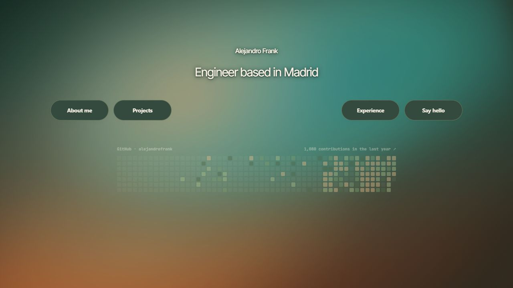

# Alejandro Frank — engineering portfolio

An interactive portfolio of the products I build and the systems behind them: Bakiano, visual experiments, and a career timeline with technical walkthroughs.

**[Explore the live site](https://me.alejandrofranks.workers.dev)** · **[Career timeline](https://me.alejandrofranks.workers.dev/timeline)** · **[Bakiano case study](https://github.com/alejandrofrank/bakiano-showcase)**

[](https://me.alejandrofranks.workers.dev)

## What you can explore

- **Projects:** Bakiano's market-data platform and its technical pipeline, plus Vesti, an outfit-search project in development.
- **Experience:** a career timeline with role-by-role system diagrams and written explanations.
- **Live activity:** a GitHub contribution calendar fetched at the edge, with a profile link available if the API is unavailable.
- **Visual interface:** an interactive gradient, expandable sections, and a layout that adapts to smaller screens.

## How it works

Hono renders HTML on Cloudflare Workers. Content, page layouts, visual effects, and data panels are separate modules. Public GitHub data uses the REST API; an optional token enables the contribution calendar through GraphQL. Responses are cached to limit repeated upstream requests.

The experience walkthroughs use a Python scene builder that produces JSON for an SVG player. The same roles are available as readable text and a print layout.

## Run locally

```bash
git clone https://github.com/alejandrofrank/alejandrofrank-eng.git
cd alejandrofrank-eng
npm ci
npm run dev
```

The basic site runs without a GitHub token. To enable the contribution calendar locally, add your token as `GITHUB_TOKEN` in a gitignored `.dev.vars` file. `GITHUB_USER` is configured in `wrangler.jsonc`.

```bash
npm run typecheck
npm run deploy
```

Deployment requires your own Cloudflare account and Worker configuration. Set the `GITHUB_TOKEN` Worker secret separately if you want the calendar in production.

## Project map

| Path | Purpose |
| --- | --- |
| `src/content.ts` | Project descriptions, links, and career context |
| `src/index.ts` | Routes: homepage, `/timeline`, `/resume`, and `/health` |
| `src/layout.ts` | Homepage composition |
| `src/panels/` | Project panels, technical explanations, and GitHub data |
| `src/timeline/` | Interactive career timeline |
| `src/resume/` | Role walkthroughs, SVG player, and readable text |
| `resume/` | Python scene builder and role definitions |
| `src/styles.ts`, `src/personal-styles.ts` | Shared and homepage styling |
| `public/` | Static assets |

## Status

Live and maintained. The homepage, project sections, career timeline, and role walkthroughs are available on the deployed site. Projects described inside the portfolio have their own status; Vesti is in development.
